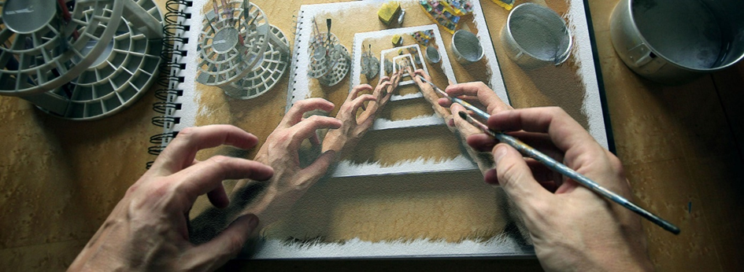
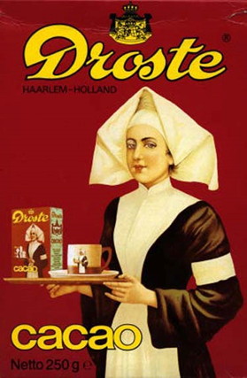
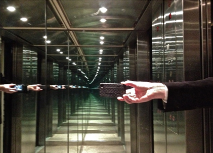

# :green_book: Inleiding

Het kan wel eens gebeuren dat je een probleem hebt waarvoor het best lastig is om een oplossing te vinden. Soms helpt het als je dan niet het hele probleem direct in één keer probeert op te lossen, maar dat je het probleem eerst een stapje klein maakt met een eenvoudige handeling en dat je dan vervolgens aan de slag gaat met het oplossen van de rest van het probleem. De rest van het probleem los je eigenlijk weer op de zelfde manier op: je maakt het probleem een stapje kleiner met een eenvoudige handeling en je lost de rest van het probleem op. Dit gaat net zolang door totdat er een restprobleem overblijft dat in één keer kan worden opgelost.

Dit idee is de basisgedachte achter een krachtig hulpmiddel waar gebruik van kan worden gemaakt om lastige klussen geklaard te krijgen: recursie. Kenmerkend voor recursie is dat een cruciaal deel van de oplossing bestaat uit het oplossen van één of meerdere kleinere identieke problemen (die op exact dezelfde manier worden opgelost).

Recursie wordt veelal geïllustreerd aan de hand van visuele effecten zoals de afbeelding aan het begin van deze inleiding, waarbij een deel van de afbeelding (de tekening waar de handen boven rusten) een kleinere versie is van de afbeelding zelf. Ook de afbeelding direct onder deze tekst is een voorbeeld van recursie; het pak cacao bevat een afbeelding van een zuster die een dienblad in haar handen heeft met daarop een pak cacao. Op dat pak cacao is dus ook weer een zuster afgebeeld met een pak cacao. Dit gaat zo oneindig lang door (het "Droste-effect").

Een ander voorbeeld is het beeld dat je krijgt als je twee spiegels recht tegenover elkaar plaatst, zoals op de foto onder deze tekst.

